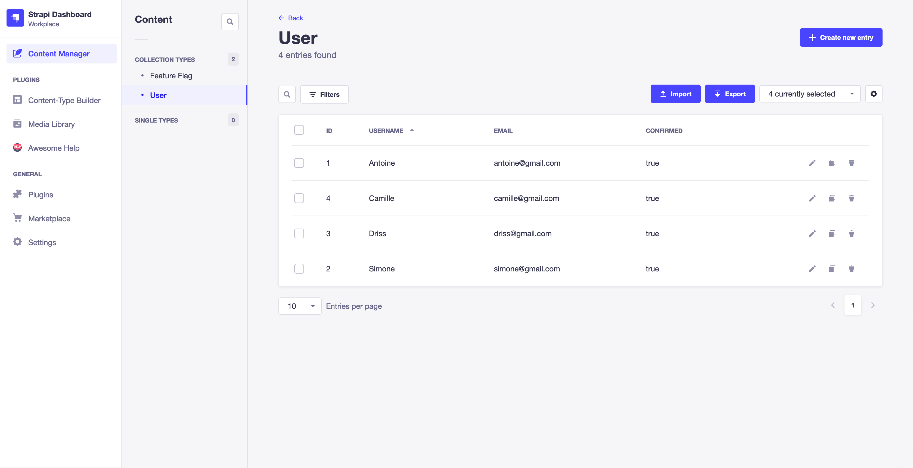
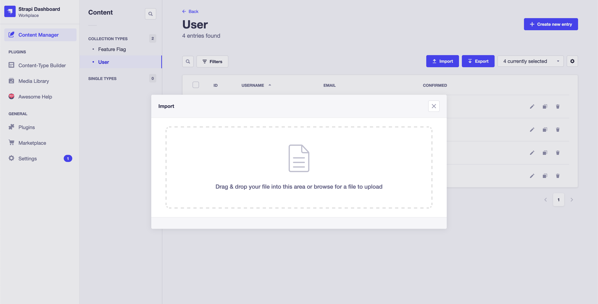
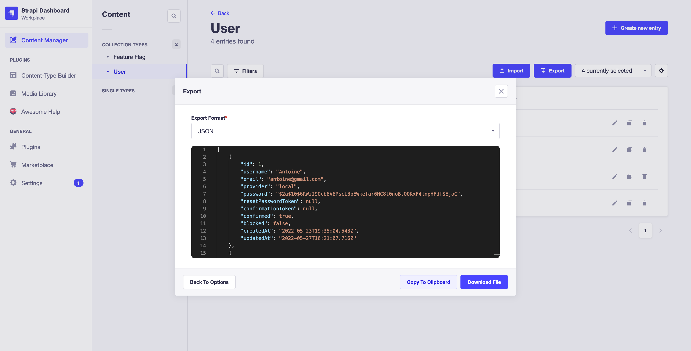
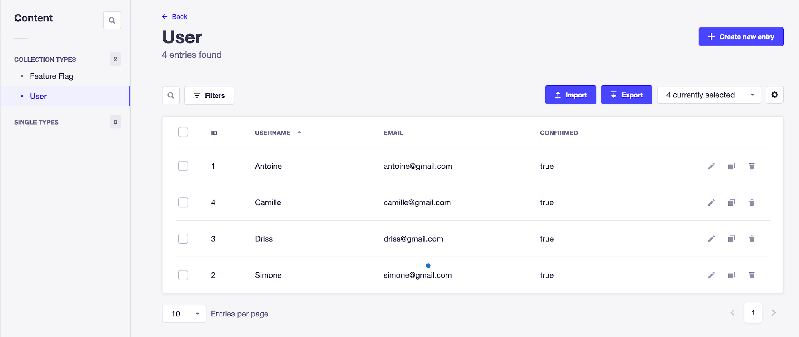
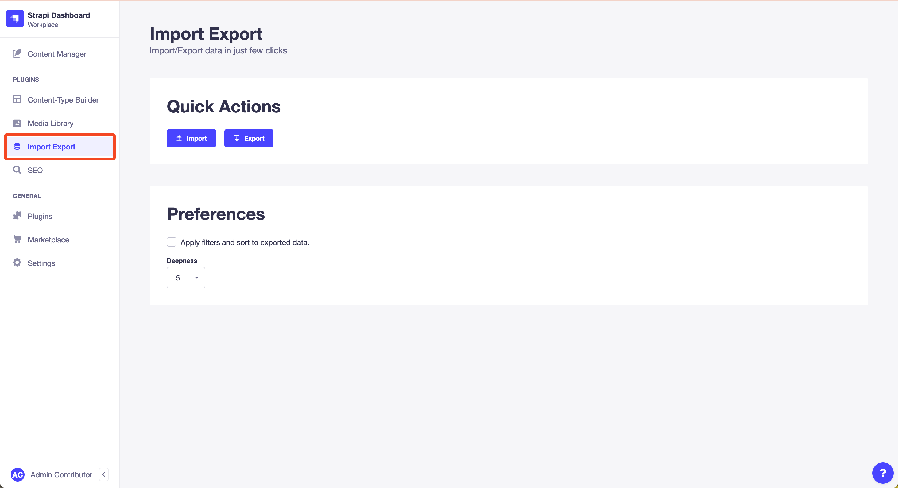
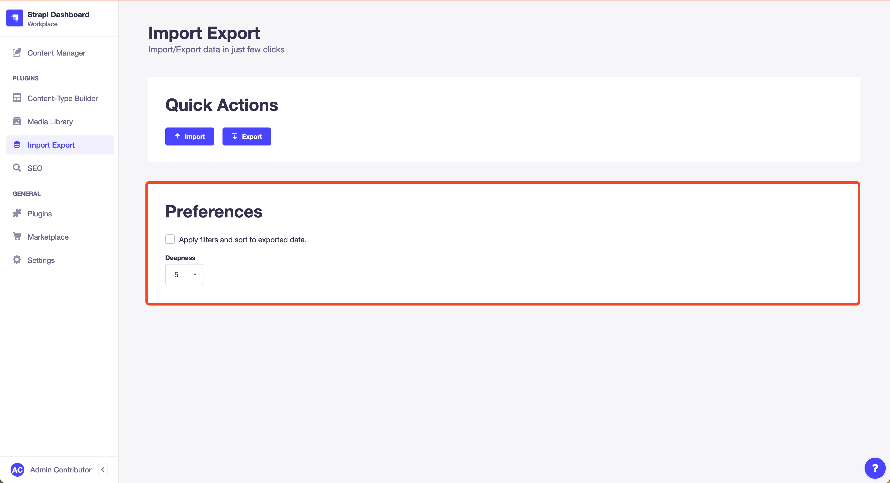
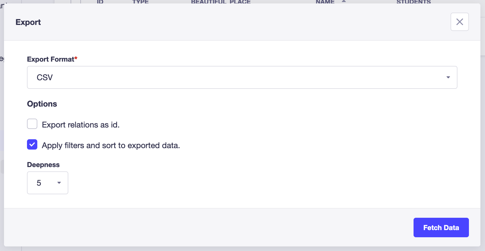

# Strapi Plugin Import Export Entries

Import/Export data from and to your database in just few clicks.

<p align="center">
  
</p>

## Features

### Import

- Import data directly from the Content Manager
- Import data from CSV and JSON file or from typing raw text according to user permissions
- Import contents to collection type/single type

### Export

- Export data directly from the Content Manager
- Export CSV and JSON contents according to user permissions
- Download files or copy exported data to clipboard
- Filter & sort data using Content Manager filters & sorting

### Known Limitations

At the moment, dynamic zones and media are not unit tested. Tests will be implemented in a near future to improve quality and development speed.

## Screenshots

<p align="center">
  
</p>
<p align="center">
  
</p>
<p align="center">
  
</p>

## Table Of Content

- [Requirements](#requirements)
- [Feedback](#feedback)
- [Contribute](#contribute)
- [Installation](#installation)
- [Rebuild The Admin Panel](#rebuild-the-admin-panel)
- [Usage](#usage)
  - [Preferences](#preferences)
  - [Config](#config)
  - [Filtering & Sorting](#filtering-and-sorting)
  - [Services](#services)
  - [Content API](#content-api)
  - [Webhook](#webhook)
- [Importing Data](#importing-data)
  - [JSON v2](#json-v2)
  - [JSON v1 (deprecated)](#json-v1-deprecated)
- [Related Plugins](#related-plugins)
- [Author](#author)
- [Acknowledgments](#acknowledgments)

## Requirements

Strapi v4 is required.

## Feedback

<p align="center">
  
</p>

Join the [Discord Community](https://discord.gg/dcqCAFFdP8) to give your feedback.

## Contribute

See the repo [Strapi Contribute](https://github.com/Baboo7/strapi-contribute#readme).

## Installation

1. Download

```
yarn add strapi-plugin-import-export-entries
```

or

```
npm i strapi-plugin-import-export-entries
```

2. Enable the plugin

Add in the file `config/plugins.js`:

```js
module.exports = ({ env }) => ({
  //...
  'import-export-entries': {
    enabled: true,
  },
  //...
});
```

3. Update the webpack config:

Create the file `src/admin/webpack.config.js`:

```js
'use strict';

const MonacoWebpackPlugin = require('monaco-editor-webpack-plugin');

module.exports = (config) => {
  config.plugins.push(new MonacoWebpackPlugin());

  return config;
};
```

4. Rollback the config of the `security` middleware:

> ⚠️ This step is only for users that used version <= `1.6.2`.

The `security` middleware does not need to be configured anymore to use of the **Monaco** code editor.

In the file `config/middlewares.js`, replace:

```js
module.exports = ({ env }) => ({
  //...
  {
    name: "strapi::security",
    config: {
      contentSecurityPolicy: {
        useDefaults: true,
        directives: {
          // Enable the download of the Monaco editor
          // from cdn.jsdelivr.net.
          "script-src": ["'self'", "cdn.jsdelivr.net", "blob:"],
          upgradeInsecureRequests: null,
        },
      },
    },
  },
  //...
});
```

with

```js
module.exports = [
  //...
  'strapi::security',
  //...
];
```

The important part here is to remove `cdn.jsdelivr.net` from the `script-src` section as it is a security vulnerability.

## Rebuild The Admin Panel

New releases can introduce changes to the administration panel that require a rebuild. Rebuild the admin panel with one of the following commands:

```
yarn build --clean
```

or

```
npm run build --clean
```

# Usage

Once the plugin is installed and setup, the functionnalities for a collection are accessible on its content management page.

<p align="center">
  
</p>

You can also export the whole database from the home page of the plugin.

<p align="center">
  
</p>

## Preferences

For a quick and convenient use, you can set your preferences from the home page of the plugin.

<p align="center">
  
</p>

Once set, they will be used each time you import/export data.

## Config

In `config/plugins.js`:

```js
module.exports = ({ env }) => ({
  //...
  'import-export-entries': {
    enabled: true,
    config: {
      /**
       * Public hostname of the server.
       *
       * If you use the local provider to persist medias,
       * `serverPublicHostname` should be set to properly export media urls.
       */
      serverPublicHostname: 'https://yoga.com', // default: "".
    },
  },
  //...
});
```

When importing data, imported file size may exceed the file size limit of the server. To lift up the limit, configure the [Strapi middleware `body`](https://docs.strapi.io/developer-docs/latest/setup-deployment-guides/configurations/required/middlewares.html#body):

```js
// ./config/middlewares.js

module.exports = {
  // ...
  {
    name: 'strapi::body',
    config: {
      jsonLimit: '10mb',
    },
  },
  // ...
}
```

## Filtering and Sorting

The filtering and sorting mechanism relies on Strapi filtering and sorting feature:

1. Connect to the content manager page of the model you want to export, and filter and sort the data as you want it to be exported.

<p align="center">
  
</p>

2. Open the export modal and check the option _Apply filters and sort to exported data_.

<p align="center">
  
</p>

3. Click on _Fetch Data_.

The exported data is filtered and sorted as expected.

## Services

```ts
/*****************************
 * Service "import".
 ****************************/

/**
 * Get the service.
 */
const service = strapi.plugin("import-export-entries").service("import");

/**
 * Method importData.
 */
await service.importData(
  /**
   * Data to import.
   * Expected type depends on the specified format:
   * - csv: string
   * - jso: object | object[]
   * - json: string
   */
  dataRaw: object | object[] | string,
  options: {
    /**
     * Slug of the imported model.
     * - "media" is a custom slug to specifically import media. See section Importing Data > Media below.
     */
    slug: "media" | string;
    /**
     * Format of the imported data.
     * - csv
     * - jso: javascript object
     * - json: javascript object notation
     */
    format: "csv" | "jso" | "json";
    /** User importing data. */
    user: object;
  }
) : Promise<{
  failures: {
    /** Error raised. */
    error: Error;
    /** Data for which import failed. */
    data: object;
  }[]
}>;
```

```ts
/*****************************
 * Service "export".
 ****************************/

/**
 * Get the service.
 */
const service = strapi.plugin("import-export-entries").service("export");

/**
 * Method exportData.
 */
await service.exportData(
  options: {
    /**
     * Slug of the model to export.
     * - "media" is a custom slug to specifically export media.
     */
    slug: "media" | string;
    /**
     * Export format.
     * - csv
     * - json: javascript object notation
     */
    exportFormat: "csv" | "json";
    /** Search query used to select the entries to export. The package `qs` is used to parse the query. */
    search?: string;
    /** Whether to apply the search query. */
    applySearch?: boolean;
    /** Whether to export relations as id instead of plain objects. */
    relationsAsId?: boolean;
    /** Deepness of the exported data. */
    deepness?: number;
  }
) : Promise<string>;
```

## Content API

Data can be imported/exported through the content api. Endpoints have to be enabled in _Settings > Users & Permissions plugin > Roles_.

```ts
/*****************************
 * Import data
 *
 * POST /api/import-export-entries/content/import
 ****************************/

type RouteParams = {
  /** Slug of the model to export. */
  slug: string;
  /**
   * Data to import.
   * if `format` is "csv", data must be a string.
   * if `format` is "json", data must be an object or an array of objects.
   * */
  data: string | Object | Object[];
  /** Format of the passed data to import. */
  format: 'csv' | 'json';
  /** Name of the field to use as a unique identifier for entries. Default: "id" */
  idField?: string;
};

type RouteReturn = {
  /** Array of failed imports. */
  failures: {
    /** Error raised during import. */
    error: string;
    /** Data for which the import failed. */
    data: Object;
  }[];
};
```

```ts
/*****************************
 * Export data
 *
 * POST /api/import-export-entries/content/export/contentTypes
 ****************************/

type RouteParams = {
  /** Slug of the model to export. */
  slug: string;
  /** Format to use to export the data. */
  exportFormat: 'csv' | 'json';
  /** Search query used to select the entries to export. The package `qs` is used to parse the query. Default: "" */
  search?: string;
  /** Whether to apply the search query. Default: false */
  applySearch?: boolean;
  /** Whether to export relations as id instead of plain objects. Default: false */
  relationsAsId?: boolean;
  /** Deepness of the exported data. Default: 5 */
  deepness?: number;
};

type RouteReturn = {
  /** Exported data. */
  data: string;
};
```

## Webhook

At the moment, the webhook is triggered only for media creation, update and deletion. It is not triggered for other data.

# Importing Data

## JSON v2

JSON v2 introduces a new supported file structure. Data is flattened and dependencies only relies on `id`s (`object`s are not supported in this new version). Collection types, single types, media and components are all treated the same for ease of use.

Here is an example:

```json
{
  "version": 2, // required for the import to work properly.
  "data": {
    // Each collection has a dedicated key in the `data` property.
    "api::collection-name.collection-name": {
      // Sub keys are `id`s of imported entries and values hold the data of the entries to import.
      "1": {
        "id": 1
        //...
      },
      "2": {
        "id": 2
        //...
      }
    },
    "api::other-collection-name.other-collection-name": {
      "1": {
        "id": 1,
        // Relations are specified by `id`s.
        "collectionAbove": [1]
        //...
      },
      "2": {
        "id": 2,
        "collectionAbove": [1, 2]
        //...
      }
    },
    // Import medias.
    "plugin::upload.file": {
      "1": {
        "id": 1
        //...
      },
      "2": {
        "id": 2
        //...
      }
    },
    // Import components.
    "my.component": {
      "1": {
        "id": 1
        //...
      },
      "2": {
        "id": 2
        //...
      }
    }
  }
}
```

## JSON v1 (deprecated)

The expected import data structure:

## Relation:

### `object`

the relation is searched in db by `id`. If an entry is found, it is updated with the provided data. Otherwise, it is created.

### `number`

The relation is treated as an id.

## Media:

### `object`

the media must have an `id`, `hash`, `name` or `url` property. First the media is searched by `id`, then by `hash`, then by `name` and finally imported from `url` if not found previously.

When imported by `url`, the `hash` and `name` of the file are deduced from the `url` (the `hash` is also deduced because Strapi exports files with their `hash` in the `url` instead of the `name`). The `hash` and `name` are used to find the media in db. First the media is searched by `hash`, then by `name` and used if found. Otherwise, the media is uploaded to the db by downloading the file from the `url`.

> ⚠️ Check the server has access to the `url`.

When imported by `url`, extra data can be provided to enhance the created file:

- `id` (_defaults to an auto generated `id`_)
- `name` (_defaults to the `name` deduced from the url_)
- `caption` (_defaults to `""`_)
- `alternativeText` (_defaults to `""`_)

### Examples

- `{ id: 1 }`
- `{ hash: "alpaga.jpg" }`
- `{ name: "alpaga.jpg" }`
- `{ url: "https://www.thetimes.co.uk/imageserver/image/alpaga.jpg" }` (Deduced file `hash` is `alpaga` and deduced `name` is `imageserver-image-alpaga.jpg`)
- `{ url: "http://localhost:1337/alpaga.jpg" }` (Deduced file `hash` is `alpaga` and deduced `name` is `alpaga.jpg`)
- `{ id: 734, url: "http://localhost:1337/alpaga.jpg", name: "Alpacool", caption: "Alpacool In Da Hood", alternativeText: "Alpacool in da hood" }`

### `string`

Same as above, except the media provided is treated as a `url`.

- `"https://www.thetimes.co.uk/imageserver/image/alpaga.jpg"` (Deduced file `hash` is `alpaga` and deduced `name` is `imageserver-image-alpaga.jpg`)
- `"http://localhost:1337/alpaga.jpg"` (Deduced file `hash` is `alpaga` and deduced `name` is `alpaga.jpg`)

### `number`

The media is treated as an id.

- `7`

## Related Plugins

- [Strapi Plugin Request Id](https://github.com/Baboo7/strapi-plugin-request-id): Add a unique id to each request made to your server and track your users' activity in the logs

## Author

Baboo - [@Baboo7](https://github.com/Baboo7)

## Acknowledgments

This plugin (and especially this README) took strong inspiration from the [strapi-plugin-import-export-content](https://github.com/EdisonPeM/strapi-plugin-import-export-content#readme) from [EdisonPeM](https://github.com/EdisonPeM).
